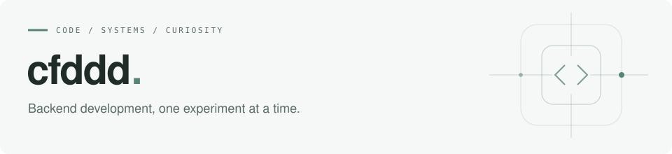

<picture>
  <source media="(prefers-color-scheme: dark)" srcset="./header-dark.svg">
  <source media="(prefers-color-scheme: light)" srcset="./header-light.svg">
  
</picture>

 

I build backend projects in **Java** and **Go**, and learn by turning ideas into working code.
This is a collection of things I have built, explored, and learned along the way.

### Selected work

| Project | Exploration |
| :--- | :--- |
| **[MicroserviceDS](https://github.com/cfddd/MicroserviceDS)** | A Go backend for a short-video app, with user, video, and social services. |
| **[SpringBootAppDemo](https://github.com/cfddd/SpringBootAppDemo)** | Java web development with Spring Boot and MySQL. |
| **[gin_study](https://github.com/cfddd/gin_study)** | Small experiments with Go and the Gin web framework. |

### Tools I work with

`Java` &nbsp; `Go` &nbsp; `Spring Boot` &nbsp; `Gin` &nbsp; `gRPC` &nbsp; `MySQL`

 

Learning through practice. Understanding through source code.
